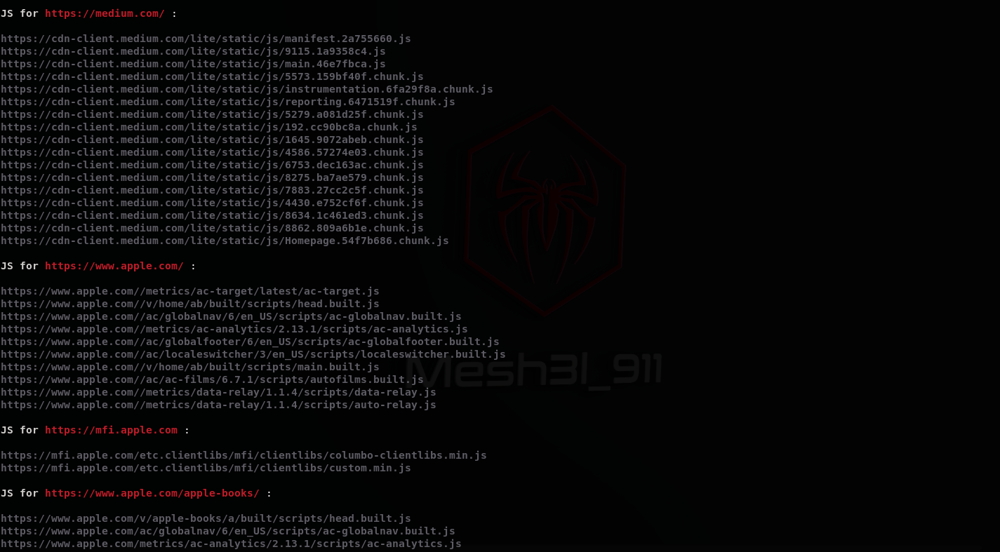

# JS_Scrapper v1.0 :

 <b>A tool that automates the process of extracting JS files out of each URL provided within the list </b>
 
 
   

# Installation : 
 <code>git clone https://github.com/Mesh3l911/JS_Scrapper.git</code>
 

# Requirements :
 
<code>pip install -r requirements.txt</code>
 

# Usage :
 
<code>python3 JS_Scrapper.py --path <listPath></code>
 

 # POC :
 <code>https://youtu.be/LqD_1LdC2Aw</code>
  

# Happy Hunting ^_^ 
